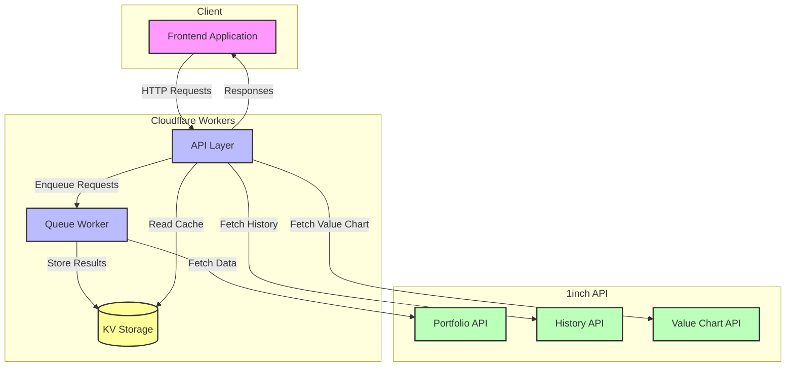

# 🌌 OrbitGO Backend

[](https://www.typescriptlang.org/)
[](https://workers.cloudflare.com/)

A powerful Cloudflare Workers service that aggregates portfolio data across multiple chains using the 1inch Portfolio API. Built with TypeScript, Hono, and Cloudflare Workers for optimal performance and reliability.

## ✨ Features

- 🔗 Multi-chain portfolio aggregation
- 🔄 Queue-based processing to handle rate limits
- 💾 KV storage for caching responses
- 📝 Structured logging with pino-pretty
- 🛡️ TypeScript for type safety

## 🌐 Supported Chains

- Ethereum (1)
- BSC (56)
- Polygon (137)
- Arbitrum (42161)
- Optimism (10)
- Avalanche (43114)
- Base (8453)
- zkSync Era (324)
- Linea (59144)

## 🔌 API Documentation

This service provides a comprehensive REST API for managing treasury data across multiple chains. For detailed API documentation, including endpoints, request/response formats, and examples, please see [API.md](API.md).

Key features of the API include:
- Multi-chain portfolio aggregation
- Historical value tracking
- Transaction history
- Rate-limited queue processing

The service integrates with the [1inch Portfolio API](https://portal.1inch.dev) and requires an API key for authentication.

## 🏗️ System Architecture



### Key Components

1. **Frontend Application**
   - Makes HTTP requests to the backend API
   - Handles data visualization and user interactions

2. **API Layer (Cloudflare Worker)**
   - Handles incoming HTTP requests
   - Manages request queuing and rate limiting
   - Aggregates data from multiple chains

3. **Queue Worker**
   - Processes portfolio data requests asynchronously
   - Respects 1inch API rate limits
   - Stores results in KV storage

4. **KV Storage**
   - Caches API responses
   - Stores portfolio data and request status
   - Enables efficient data aggregation

5. **1inch APIs**
   - Portfolio API: Fetches token holdings and balances
   - History API: Retrieves transaction history
   - Value Chart API: Gets historical value data

## 🚀 Setup

1. Install dependencies:

```bash
npm install
```

2. Configure environment variables:

```
INCH_API_KEY=your_api_key_here
```

3. Run locally:

```bash
npm run dev
```

## 📦 Deployment

Deploy to Cloudflare Workers:

```bash
npm run deploy
```

## 💻 Development

- `src/index.ts`: Main application entry point and API routes
- `src/services/inchService.ts`: Core service for interacting with 1inch API
- `src/utils/logger.ts`: Structured logging configuration
- `src/types/inch.ts`: TypeScript interfaces for API responses

## ⚡ Queue Processing

## 🔄 Frontend Integration

To integrate with the frontend, follow these steps:

1. **Installation**

```bash
npm install axios
```

2. **API Client Setup**

```typescript
const api = axios.create({
  baseURL: "YOUR_BACKEND_URL",
  timeout: 10000,
});
```

3. **Example Usage**

```typescript
// Fetch portfolio data
const getPortfolio = async (address: string) => {
  const response = await api.get(`/portfolio/${address}`);
  return response.data;
};

// Start chain-specific fetch
const fetchChainData = async (chainId: number, address: string) => {
  const response = await api.post("/portfolio/fetch", { chainId, address });
  return response.data.requestId;
};
```

## 🔄 Queue Processing

The service uses Cloudflare Queue to handle rate limiting when fetching portfolio data:

1. Requests are enqueued with chain and address information
2. Queue processor fetches data from 1inch API
3. Results are stored in KV with format: `portfolio-{address}-{chainId}-{requestId}`
4. Aggregation endpoint combines data from KV storage

## ⚠️ Error Handling

- Failed requests are stored in KV with error information
- Rate limiting is implemented (10 requests per second during hackathon)
- Detailed error logging with context
- Proper HTTP status codes for API responses
