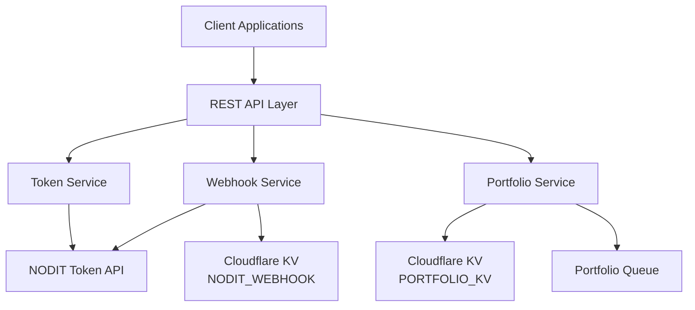
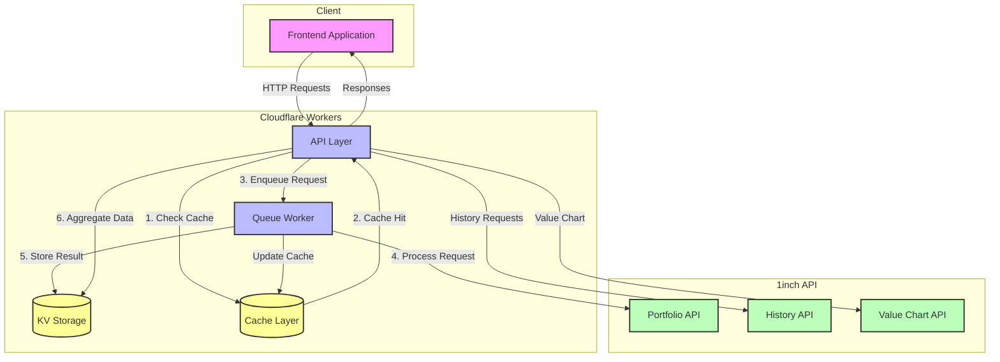

# 🌌 OrbitGO Backend

[](https://www.typescriptlang.org/)
[](https://workers.cloudflare.com/)

A powerful Cloudflare Workers service that aggregates portfolio data across multiple chains using the 1inch Portfolio API. Built with TypeScript, Hono, and Cloudflare Workers for optimal performance and reliability.

## ✨ Features

### Token Management
- Query token balances for any account across supported protocols
- Support for pagination and filtering by contract addresses
- Full integration with NODIT Token API

- 🔗 Multi-chain portfolio aggregation
- 🔄 Queue-based processing to handle rate limits
- 💾 KV storage for caching responses
- 📝 Structured logging with pino-pretty
- 🛡️ TypeScript for type safety

## 🌐 Supported Chains

- Ethereum (1)
- BSC (56)
- Polygon (137)
- Arbitrum (42161)
- Optimism (10)
- Avalanche (43114)
- Base (8453)
- zkSync Era (324)
- Linea (59144)

## 🔌 API Documentation

This service provides a comprehensive REST API for managing treasury data across multiple chains. For detailed API documentation, including endpoints, request/response formats, and examples, please see [API.md](API.md).

Key features of the API include:
- Multi-chain portfolio aggregation with automatic data fetching
- Historical value tracking with caching support
- Detailed transaction history with filtering options
- Efficient queue-based processing for rate limits

The service integrates with the [1inch Portfolio API](https://portal.1inch.dev) and requires an API key for authentication.

## 🔧️ System Architecture

### System Overview



### Core Services

1. **Token Service**
   - Manages token balance queries across multiple protocols
   - Integrates with NODIT Token API for real-time data
   - Supports pagination and contract filtering

2. **Webhook Service**
   - Handles webhook subscriptions for transaction monitoring
   - Stores webhook metadata in Cloudflare KV
   - Supports address-based filtering and retrieval

3. **Portfolio Service**
   - Aggregates multi-chain portfolio data
   - Uses queue-based processing for rate limiting
   - Caches responses in Cloudflare KV

### Infrastructure

1. **Storage Layer**
   - **NODIT_WEBHOOK KV**: Persistent storage for webhook subscriptions
   - **PORTFOLIO_KV**: Cache for portfolio aggregation results
   - **Queue System**: Asynchronous job processing for portfolio updates

2. **API Layer**
   - RESTful endpoints with OpenAPI documentation
   - Request/response validation using Zod schemas
   - Comprehensive error handling and logging
   - CORS-enabled for client applications

### Request Flow



### Key Components

1. **Frontend Application**
   - Makes HTTP requests to the backend API
   - Handles data visualization and user interactions
   - Supports real-time portfolio tracking

2. **API Layer (Cloudflare Worker)**
   - Handles incoming HTTP requests
   - Implements intelligent caching strategy
   - Automatically triggers data fetching when needed
   - Aggregates multi-chain portfolio data

3. **Cache Layer**
   - Provides fast access to frequently requested data
   - Implements TTL-based cache invalidation
   - Reduces load on external APIs

4. **Queue Worker**
   - Processes portfolio requests asynchronously
   - Implements rate limiting (10 RPS)
   - Updates cache on new data
   - Handles request retries and error recovery

5. **KV Storage**
   - Stores portfolio data and request status
   - Enables efficient cross-chain data aggregation
   - Maintains request history and error logs

6. **1inch APIs**
   - Portfolio API: Real-time token holdings and balances
   - History API: Detailed transaction history with filtering
   - Value Chart API: Historical portfolio value tracking

## 🚀 Setup

1. Install dependencies:

```bash
npm install
```

2. Configure environment variables:

```
INCH_API_KEY=your_api_key_here
```

3. Run locally:

```bash
npm run dev
```

## 📦 Deployment

Deploy to Cloudflare Workers:

```bash
npm run deploy
```

## 💻 Development

- `src/index.ts`: Main application entry point and API routes
- `src/services/inchService.ts`: Core service for interacting with 1inch API
- `src/utils/logger.ts`: Structured logging configuration
- `src/types/inch.ts`: TypeScript interfaces for API responses

## 🔄 Frontend Integration

To integrate with the frontend, follow these steps:

1. **Installation**

```bash
npm install axios
```

2. **API Client Setup**

```typescript
const api = axios.create({
  baseURL: "YOUR_BACKEND_URL",
  timeout: 10000,
});
```

3. **Example Usage**

```typescript
// Fetch aggregated portfolio data
const getPortfolio = async (address: string) => {
  const response = await api.get(`/portfolio/${address}`);
  return response.data;
};

// Get value chart data
const getValueChart = async (address: string, timerange = "1month") => {
  const response = await api.get(`/portfolio/${address}/value-chart?timerange=${timerange}`);
  return response.data;
};

// Get transaction history
const getHistory = async (address: string, limit = 100) => {
  const response = await api.get(`/portfolio/${address}/history?limit=${limit}`);
  return response.data;
};
```

## ⚡ Queue Processing

The service uses Cloudflare Queue to handle rate limiting when fetching portfolio data:

1. Portfolio requests are automatically enqueued when data is needed
2. Queue processor respects 1inch API rate limits (10 RPS)
3. Results are cached in KV storage for improved performance
4. Aggregation combines data from all chains automatically

## ⚠️ Error Handling

- Failed requests are stored in KV with error information
- Rate limiting is implemented (10 requests per second during hackathon)
- Detailed error logging with context
- Proper HTTP status codes for API responses
